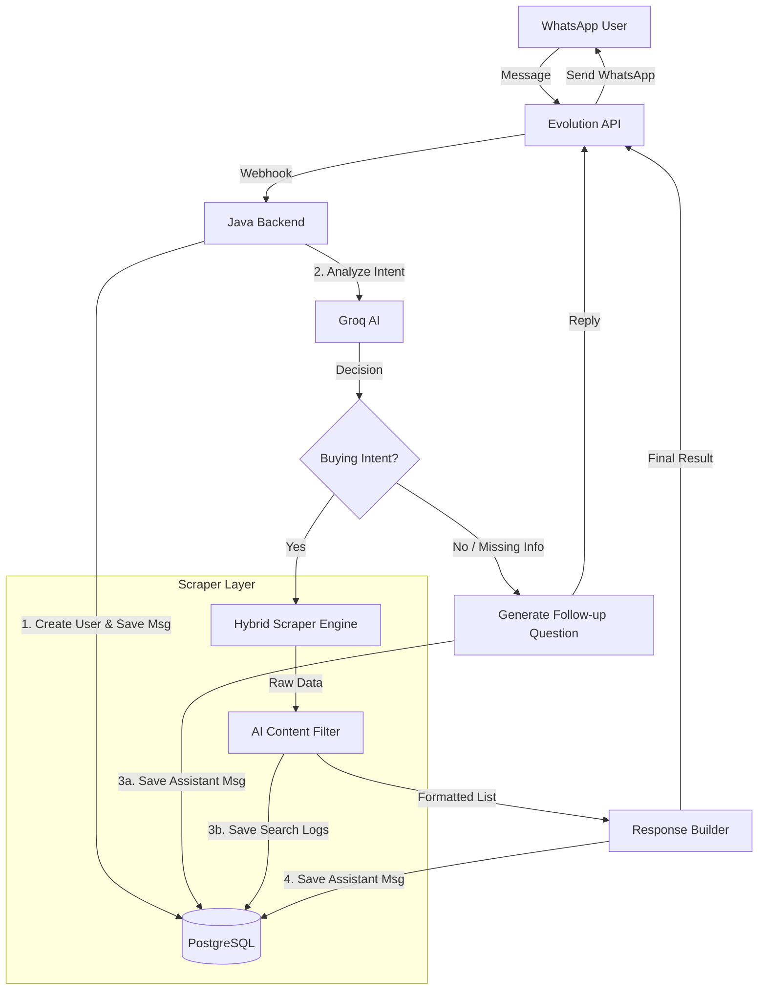

# 🛒 Shopping Agent (Agente de Compras)

A centralized scraping and AI-powered service that searches for and compares products across multiple marketplaces via WhatsApp.


## 📖 About The Project

The **Shopping Agent** is a conversational bot designed to simplify online price search and comparison. Instead of manually searching multiple sites, users simply send a product name to the bot via WhatsApp.

The system uses **LLMs (Large Language Models)** to understand user intent, normalizes data from different e-commerce structures, and returns a consolidated list of offers.

### 🎯 Key Features

* **Multi-Store Search:** Scrapes and normalizes data from multiple marketplaces in real-time.
* **Hybrid Scraping Engine:** Implements a smart scraping strategy that uses direct parsing for standard sites and **SerpAPI (Google Shopping)** for complex marketplaces (e.g., Shopee, Casas Bahia) to bypass anti-bot protections.
* **AI Intent Recognition:** Uses **Groq API** to classify user inputs (Search vs. Clarification) and extract products attributes (Brand, Model).
* **Conversational Refinement:** If a search is vague (e.g., "iPhone"), the AI asks follow-up questions to narrow down the scope.
* **WhatsApp Integration:** Full integration via **Evolution API** webhooks.
* **Production Ready:** Deployed on **AWS EC2** with **Docker Compose** and **Nginx Proxy Manager** (SSL). Includes **Redis** for robust session management within the Evolution API.

---

## 🏗️ Architecture

The system follows a microservices-inspired architecture containerized with Docker.


### 🔧 Tech Stack

* **Backend:** Java 21, Spring Boot 4
* **Database:** PostgreSQL (Data), Redis (Cache for Evolution API)
* **Infrastructure:** AWS EC2, Docker Compose
* **Security:** Nginx Proxy Manager (SSL/Let's Encrypt)
* **Integrations:**
    * **Evolution API:** WhatsApp connection
    * **Groq API:** Llama-3 for intent classification
    * **SerpAPI:** Scraper for complex sites (Hybrid Engine)

---

## 🚀 How to Run

### Prerequisites

Before running the project, ensure you have the following installed:

* **[Docker & Docker Compose](https://www.docker.com/products/docker-desktop/)** (Required for the full environment)
* **[Java 21](https://www.oracle.com/java/technologies/downloads/#java21)** (Required for local development)
* **[Maven](https://maven.apache.org/download.cgi)** (Required for local development)
* **API Keys:**
    * [Groq Cloud](https://console.groq.com/) (For Intent Analysis)
    * [SerpAPI](https://serpapi.com/) (For Google Shopping scraping)
    * [Evolution API](https://github.com/EvolutionAPI/evolution-api) (Included in Docker Compose)

### Installation

#### 1. Clone the repository

```bash
git clone https://github.com/marcub/agente-compras-java.git
cd agente-compras-java
```

#### 2. Configure Environment Variables

Create a `.env` file in the root directory with the following content:

```env
# Database
DB_PASSWORD=your_secure_password

# External APIs
GROQ_API_KEY=your_key
SERPAPI_API_KEY=your_key

# Evolution API
EVOLUTION_API_KEY=your_key
EVOLUTION_INSTANCE=your_instance_name

# Application
APP_BASE_URL=https://agentecompras.tech
# Use http://localhost:8080 when running locally
```

---

#### 3. Running the Application

You can run the application in **local development mode** or **production mode**.

---

#### Option A: Local Development

Start the required services (Postgres and Evolution API):

```bash
docker compose up -d
```

> **Services started:**
>
> * Postgres → `localhost:5433`
> * Evolution API → `localhost:8081`

Then, in a separate terminal or directly from your IDE:

* Run the Java application using your IDE
  **or**
* Start it via Maven if preferred

---

#### Option B: Production Mode (Deployment)

Start the full stack behind **Nginx Proxy Manager**:

```bash
docker compose -f docker-compose.prod.yml up -d --build
```

#### Post-Installation:

> **Required step**
> After all containers are up and running, you must connect the bot to WhatsApp.

1. Access the **Evolution API Manager**:

    * Local: `http://localhost:8081/manager`
    * Production: `https://yourdomain.com` (or the configured Evolution API domain)

2. Create an instance and update the EVOLUTION_INSTANCE variable in your `.env` file accordingly.

3. Scan the generated **QR Code** using your phone’s WhatsApp app.

4. Once connected, configure the webhook URL in Evolution API to point to your application:

   * Local: `http://localhost:8080/whatsapp/webhook`
   * Production: `https://yourdomain.com/whatsapp/webhook` (or the configured Evolution API domain)

---

## 👤 Author

**Marcus Cezar**
* [LinkedIn](https://linkedin.com/in/marcuscezar)
* [GitHub](https://github.com/marcub)