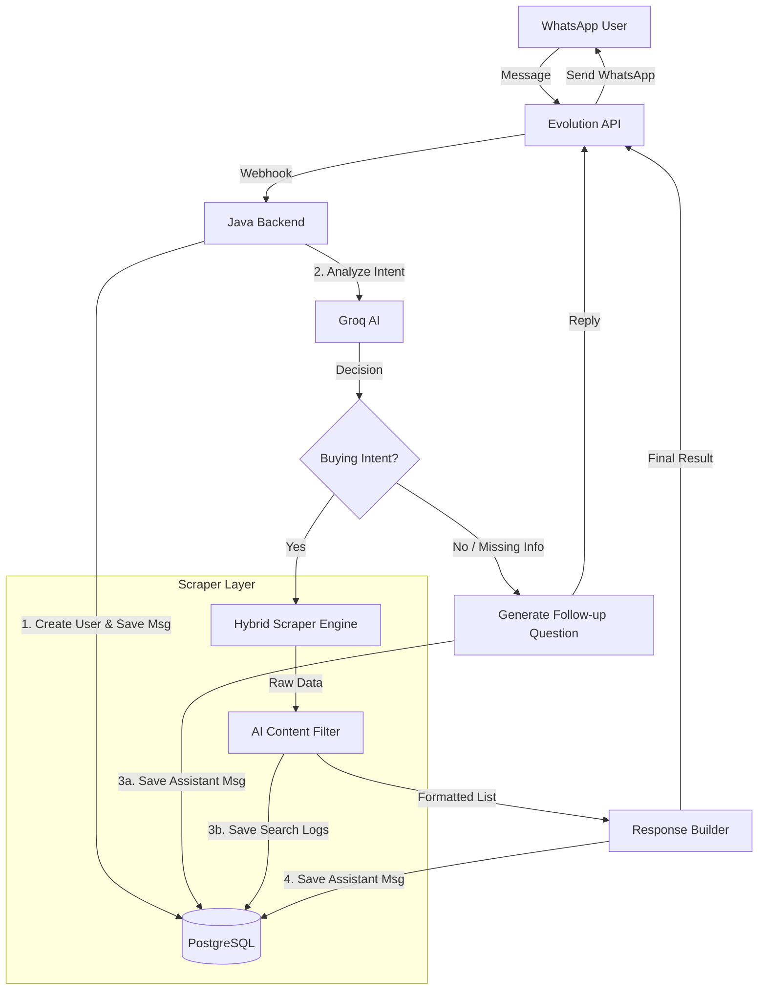

# 🛒 Shopping Agent (Agente de Compras)

A centralized scraping and AI-powered service that searches for and compares products across multiple marketplaces via WhatsApp.


## 📖 About The Project

The **Shopping Agent** is a conversational bot designed to simplify online price search and comparison. Instead of manually searching multiple sites, users simply send a product name to the bot via WhatsApp.

The system uses **LLMs (Large Language Models)** to understand user intent, normalizes data from different e-commerce structures, and returns a consolidated list of offers.

### 🎯 Key Features

* **Multi-Store Search:** Scrapes and normalizes data from multiple marketplaces in real-time.
* **Hybrid Scraping Engine:** Implements a smart scraping strategy that uses direct parsing for standard sites and **SerpAPI (Google Shopping)** for complex marketplaces (e.g., Shopee, Casas Bahia) to bypass anti-bot protections.
* **AI Intent Recognition:** Uses **Groq API** to classify user inputs (Search vs. Clarification) and extract products attributes (Brand, Model).
* **Conversational Refinement:** If a search is vague (e.g., "iPhone"), the AI asks follow-up questions to narrow down the scope.
* **WhatsApp Integration:** Full integration via **Evolution API** webhooks.
* **Production Ready:** Deployed on **AWS EC2** with **Docker Compose** and **Nginx Proxy Manager** (SSL). Includes **Redis** for robust session management within the Evolution API.

---

## 🏗️ Architecture

The system follows a microservices-inspired architecture containerized with Docker.


### 🔧 Tech Stack

* **Backend:** Java 21, Spring Boot 4
* **Database:** PostgreSQL (Data), Redis (Cache for Evolution API)
* **Infrastructure:** AWS EC2, Docker Compose
* **Security:** Nginx Proxy Manager (SSL/Let's Encrypt)
* **Integrations:**
    * **Evolution API:** WhatsApp connection
    * **Groq API:** Llama-3 for intent classification
    * **SerpAPI:** Scraper for complex sites (Hybrid Engine)

---

## 🚀 How to Run

### Prerequisites

Before running the project, ensure you have the following installed:

* **[Docker & Docker Compose](https://www.docker.com/products/docker-desktop/)** (Required for the full environment)
* **API Keys:**
    * [Groq Cloud](https://console.groq.com/) (For Intent Analysis)
    * [SerpAPI](https://serpapi.com/) (For Google Shopping scraping)

### Installation

#### 1. Clone the repository

```bash
git clone https://github.com/marcub/agente-compras-java.git
cd agente-compras-java
```

#### 2. Configure Environment Variables

Create a `.env` file in the root directory with the following content:

```env
# Database
DB_PASSWORD=your_secure_password

# External APIs
GROQ_API_KEY=your_key
SERPAPI_API_KEY=your_key

# Evolution API
EVOLUTION_URL=http://localhost:8081
EVOLUTION_API_KEY=create_your_evolution_api_key_here
EVOLUTION_INSTANCE=agente-compras

# Application
APP_BASE_URL=http://localhost:8080
```

#### 3. Running the Application

```bash
docker compose up -d
```
⏳ **Wait ~30 seconds** for the services (Database and Evolution API) to fully initialize before proceeding.

#### 4. Configure WhatsApp Connection:

> **Required Step:** The bot requires a manual connection to WhatsApp to function.

1. Access the **Evolution API Manager**:
* [http://localhost:8081/manager](http://localhost:8081/manager)
2. Login using the `EVOLUTION_API_KEY` you defined in your `.env` file.
3. **Create an Instance:**
   * **Name:** `agente-compras` (Must match `EVOLUTION_INSTANCE` in .env)
   * **Channel:** Select **Baileys**.
   * **Token:** Use the same `EVOLUTION_API_KEY`.
4. **Scan QR Code:** Click "Get QR Code" (or the QR icon) and scan the code with your WhatsApp.
5. **Configure Webhook (Crucial):**
   * Go to the **"Webhooks"** tab.
   * **Enable Webhook:** Toggle the switch to **ON**.
   * **URL:** Set to `http://agente-app:8080/whatsapp/webhook`
     *(Note: `agente-app` is the internal Docker container name).*
   * **Events:** Select **only** `MESSAGES_UPSERT`.
6. Click **Save**.
7. **Test:** Send a text message (e.g., "Notebook Dell") to your WhatsApp number to test the bot!

---

## 👤 Author

**Marcus Cezar**
* [LinkedIn](https://linkedin.com/in/marcuscezar)
* [GitHub](https://github.com/marcub)